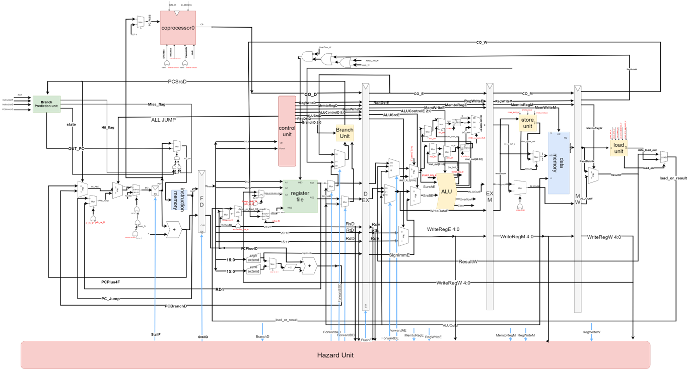

# MIPS Processor

This project implements a **MIPS Processor** with peripheral interfaces in Verilog HDL. The processor supports a 5-stage pipelined architecture including **instruction fetch, decode, execute, memory access,** and **write-back** stages, along with UART, GPIO, Timer, and other memory-mapped peripherals.

## Features

- **5-stage pipelined MIPS Processor** (IF, ID, EX, MEM, WB stages)
- Hazard Detection and Forwarding Units for pipeline control
- Instruction Memory and Data Memory modules
- UART interface for serial communication
- GPIO interface for I/O operations
- Timer peripheral with interrupt support
- AHB/APB bridge for peripheral interfacing
- Interrupt Controller for multiple interrupt sources
- Branch Prediction Unit for control hazard optimization
- Coprocessor integration support

---

## System Interface Overview

This diagram shows the top-level SoC integration of the MIPS processor with peripherals such as UART, GPIO, Timer, and PADs:


---

## Processor Micro-Architecture

This diagram shows the internal pipeline stages and main components of the MIPS processor:



---

## Repository Structure

```bash
.
.
├── AHP_IF.sv                  # AHB/APB bridge interface
├── ALU.v                      # Arithmetic Logic Unit
├── ALU_Decoder.v              # ALU control decoder
├── APB_Master.sv              # APB bus master interface
├── BI_PAD.sv                  # PAD interface logic
├── Branch_unit.v              # Branch decision logic
├── CO_PROC_0.v                # Coprocessor logic
├── Comparator.v               # Comparison logic for branches
├── control_unit.v             # Main control signal generator
├── data_mem.sv                # Data memory module
├── decode_execute_reg.v       # Pipeline register between decode and execute
├── div.v                      # Divider unit
├── excute_memory_reg.v        # Pipeline register between execute and memory
├── fetch_decode_reg.v         # Pipeline register between fetch and decode
├── handler.mem                # exception handler instructions
├── hazardUnit.sv              # Hazard detection unit
├── instr_mem.v                # Instruction memory
├── Load_Unit.v                # Load operation unit
├── main_decoder.v             # Main instruction decoder
├── memory_writeback_reg.v     # Pipeline register between memory and write-back
├── MIPS_Pipeline_TB.sv        # Testbench for the MIPS pipeline
├── module_tb_cmsdk_apb_timer().sv # Timer module 
├── multi_des.v                # Multiplier logic
├── MUX.v                      # Multiplexer
├── MUX41.v                    # 4-to-1 multiplexer
├── predictor.sv               # Branch predictor
├── Regs.v                     # Register file
├── run.txt                    # Simulation script or test instructions
├── shifter.v                  # Shifter logic
├── sign_extend.v              # Immediate sign extension unit
├── Store_Unit.v               # Store operation unit
├── Test1_v2.mem - Test5.mem   # Test memory files
├── TOP.v                      # Top-level module
├── wrapper.v                  # Wrapper module for integration
├── cmsdk_ahb_gpio.v           # GPIO AHB slave
├── cmsdk_ahb_to_io.v          # IO interface logic
├── cmsdk_apb_timer.v          # APB timer module
├── cmsdk_apb_uart.v           # UART interface
├── cmsdk_iop_gpio.v           # IOP GPIO module
├── interface.png              # Top-level SoC diagram
├── mips.png                   # MIPS pipeline architecture diagram
├── README.md                  # Project documentation (this file)
```

---

## Usage

1. **Simulation:**  
   Simulate the design using your preferred Verilog simulator (e.g., ModelSim, VCS).

2. **Synthesis:**  
   Synthesize the design using tools like Vivado for FPGA implementation.

3. **Hardware Implementation:**  
   - Target FPGA: Zybo (or compatible FPGA).
   - You can run the SoC on your FPGA board and interface via UART or GPIO.

---

## Highlights

- Designed for educational and experimental purposes.
- Modular and scalable design with clean hierarchy.
- Supports interrupt-based peripheral operations.
- Optimized for FPGA prototyping.
---

## Author

[Sara Mahmoud](https://github.com/Sara2mahmoud)
